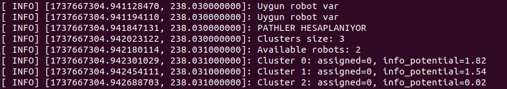
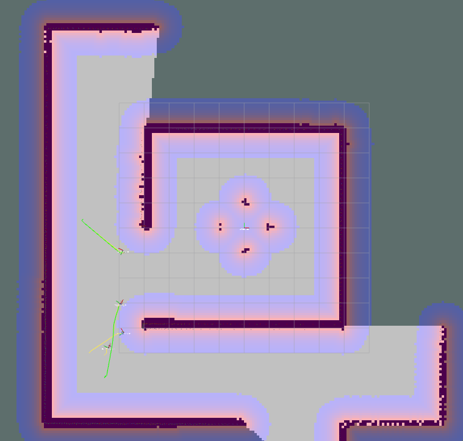
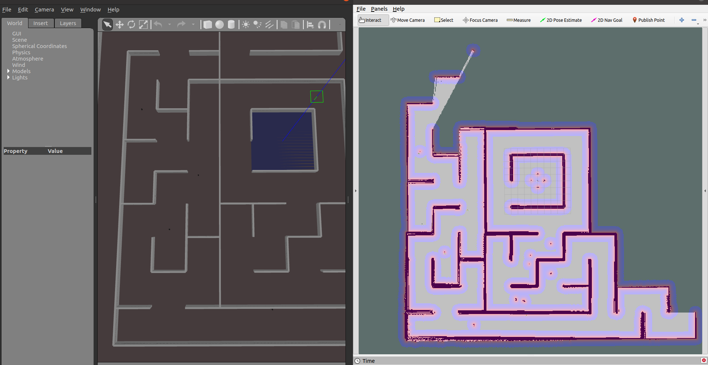
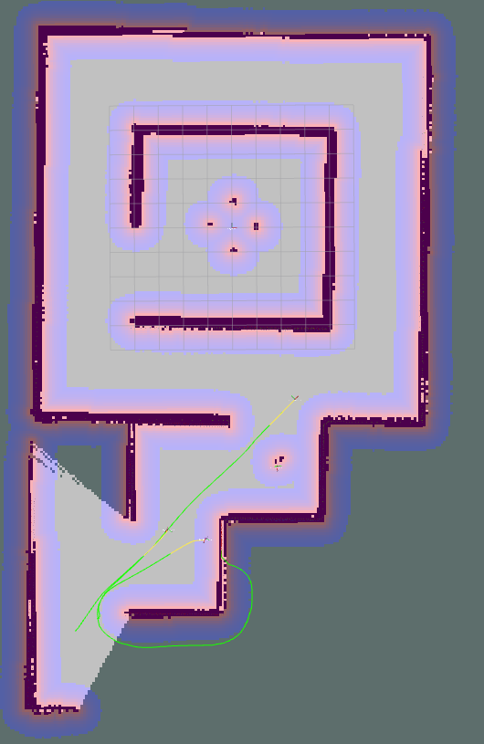
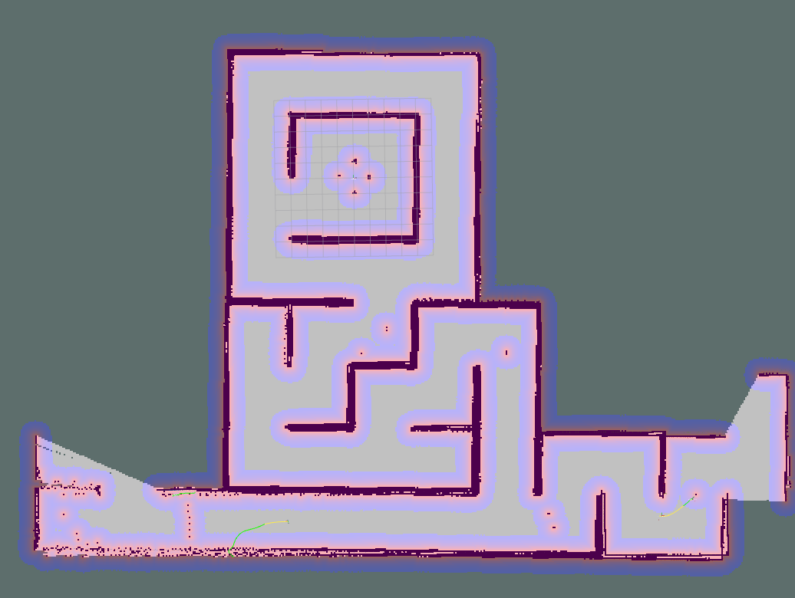
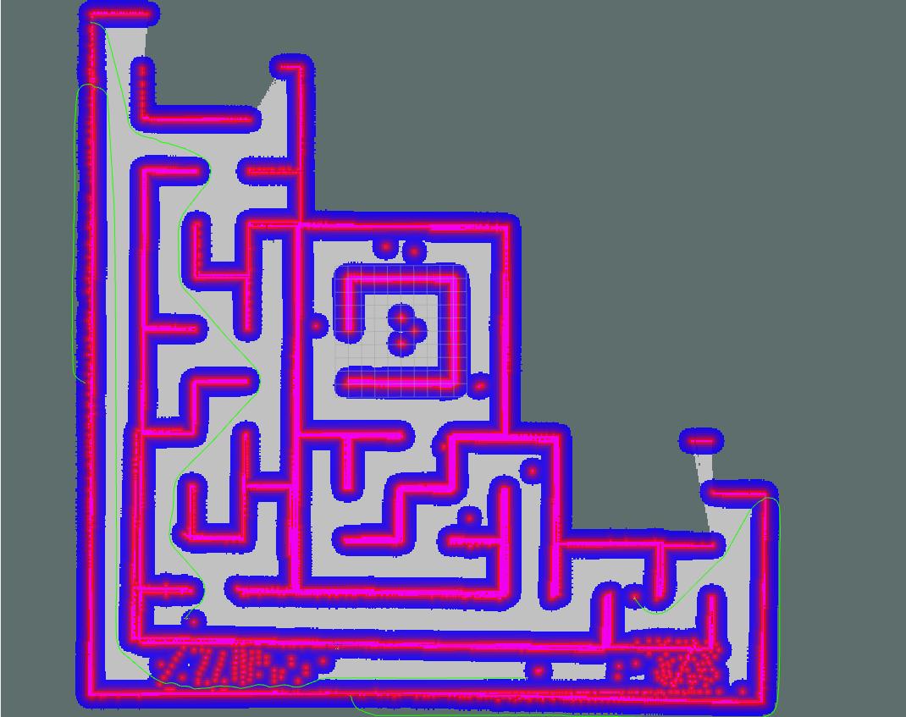
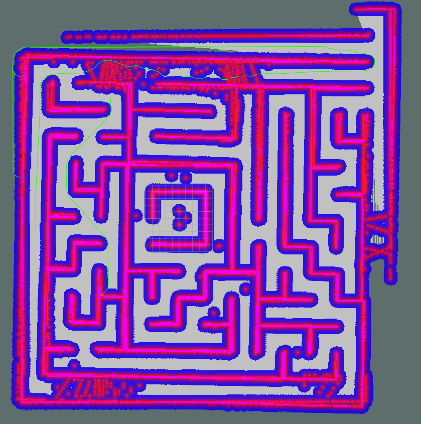

# BLM6191 Robotlar Final

ROS1 Noetic ortamında dört farklı TurtleBot3 robotu kullanarak bir ortamı otonom olarak keşfetmek ve birleştirilmiş tek bir küresel harita oluşturmak için çok robotlu bir sınır kaşifi geliştirilmiştir.

## Ortam Kurulumu
```
sudo apt-get install ros-noetic-multirobot-map-merge
cd ~/robotlar_ws/src
git clone https://gitlab.com/blm6191_2425b/blm6191/micromouse_maze.git
git clone https://gitlab.com/blm6191_2425b/blm6191/turtlebot3.git
git clone https://gitlab.com/blm6191_2425b/blm6191/turtlebot3_simulations.git
cd ~/robotlar_ws
rosdep install --from-paths src --ignore-src --rosdistro noetic -y
catkin_make
source ~/.bashrc

gedit ~/.bashrc --> TURTLEBOT3_MODEL = burger
```

## Simülasyon Ortamını Ayağa Kaldırma
Simülasyon ortamlarını ayağa kaldırın.
```
roslaunch micromouse_maze micromouse_maze3_multi.launch
roslaunch turtlebot3_gazebo multi_map_merge.launch
roslaunch turtlebot3_gazebo multi_turtlebot3_slam.launch
roslaunch turtlebot3_navigation multi_move_base.launch
roslaunch micromouse_maze multi_robot_rviz.launch
```

multi_robot_exploration node'unu çalıştırın.
```
rosrun multi_robot_exploration multi_robot_exploration
```

## MultiRobotExplorer
Çoklu robot keşif algoritması aşağıdaki adımlardan oluşur,

**Frontier Tespiti ve Kümeleme:**
findFrontierClusters() fonksiyonu çağrılarak keşfedilmemiş sınır bölgeleri tespit edilir. 
Frontier hücreleri, Bilinmeyen alanlara komşu olan hücreler, isFrontierCell() ile belirlenir.

**Kümeler oluşturma**: Bağlantılı frontier hücreleri, labelComponent() fonksiyonu ile CLC kullanılarak kümelenir.
Her küme için centroid (merkez nokta) ve bilgi potansiyeli gibi özellikler calculateClusterProperties() fonksiyonu ile hesaplanır. Eğer frontier bölgeleri bulunmazsa, algoritma bir sonraki harita güncellemesini bekler.

**Robot Pozisyonunun Belirlenmesi:**
Robotların pozisyonu, odometri verileri kullanılarak sürekli olarak harita çerçevesinde güncellenir. Bu işlem, poseCallback() fonksiyonu ile gerçekleştirilir ve robotun yerel çerçevesi ile global harita çerçevesi arasındaki dönüşüm tf2 kullanılarak hesaplanır.

**Hedef Atama:**
Eğer frontier kümeleri bulunursa, assignTargets() fonksiyonu, mevcut robotlara frontier kümelerini fayda değerlerine göre atar. Fayda değeri şu şekilde hesaplanır:
Fayda = Bilgi Potansiyeli − (Mesafe * ALPHA), bu hesaplama calculateUtility() fonksiyonu ile yapılır. Her robot için en yakın ve erişilebilir hedef findAccessibleTarget() fonksiyonu ile belirlenir. Hedef, sendGoal() fonksiyonu kullanılarak ilgili robota gönderilir.

**Rota Planlama ve Önbellek Kullanımı:**
Yol hesaplamalarını optimize etmek için algoritma, PathCache yapısını kullanır. Bu yapı, robotlar ile frontier kümeleri arasındaki daha önce hesaplanan yol uzunluklarını saklar ve gereksiz hesaplamaların önüne geçer. Eğer önbellek süresi dolmuşsa veya geçerli değilse, yollar calculateAllPaths() fonksiyonu ile yeniden hesaplanır.

**Robot Hareketi ve İzleme:**
Hedef atandıktan sonra, move_base action client kullanılarak robota hareket komutu gönderilir. Robotun hedefe ilerlemesi doneCallback(), activeCallback() ve feedbackCallback() fonksiyonları ile izlenir. Bu geri bildirimler, robot durumunun güncellenmesini ve gerekli durumlarda yeniden hedef ataması yapılmasını sağlar.

**Yeniden Atama ve Alternatif Hedefler:**
Eğer bir robot hedefe ulaşamaz veya engellerle karşılaşırsa, algoritma küme içindeki alternatif hedefleri dener. Tüm alternatifler başarısız olursa, robot yeni hedefler için yeniden uygun hale getirilir.

## Sonuçlar
Debug çıktısı:
<p>

</p>


Keşif Başlangıç - 1
<p>

</p>

<p>

</p>

<p>

</p>

<p>

</p>

<p>

</p>

<p>

</p>
